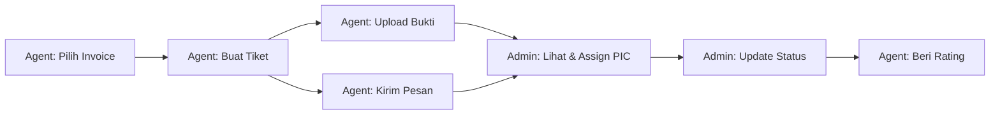

# Dokumentasi API Backend — Perubahan & Customer Care

---

## BAGIAN A: API yang BERUBAH

---

### 1. `GET /api/super-admin/withdraws`
**Role:** Super Admin

**Perubahan:** Response diperkaya dengan detail bank penerima + bukti transfer.

**Field baru per item:**
```json
{
  "user": { "id": 5, "name": "John Doe", "detail_user": { "bank_name": "BCA", "account_number": "1234567890" } },
  "nama_penerima": "John Doe",
  "recipient_name": "John Doe",
  "account_holder": "John Doe",
  "bank_name": "BCA",
  "bank": "BCA",
  "account_number": "1234567890",
  "nomor_rekening": "1234567890",
  "transfer_proof": "",
  "payment_proof": "",
  "bukti_transfer": ""
}
```

---

### 2. `GET /api/agent/withdraws`
**Role:** Agent

**Field baru per item:**
```json
{
  "transfer_proof": "https://storage.../payment_proofs/abc.jpg",
  "payment_proof": "https://storage.../payment_proofs/abc.jpg",
  "proof_of_transfer": "https://storage.../payment_proofs/abc.jpg"
}
```

---

### 3. `PUT /api/super-admin/withdraws/:id/approve`
**Role:** Super Admin

**Perubahan:** Kini juga menerima `multipart/form-data` + file bukti transfer.

```
POST /api/super-admin/withdraws/1/approve
Content-Type: multipart/form-data
→ field: transfer_proof [FILE]
```

> [!NOTE]
> Nama field file yang diterima: `transfer_proof`, `payment_proof`, `proof`, `file`, atau `bukti_transfer`.

---

### 4. `PUT /api/sales/preorders/:id/status`
**Role:** Sales

**Perubahan:** Menerima 2 status baru + field opsional `payment_status`.

**Payload:**
```json
{
  "status": "shipped",
  "payment_status": "shipped"
}
```

| `status` values | Keterangan |
|---|---|
| `approve` | Disetujui (existing) |
| `invalid` | Ditolak (existing) |
| `shipped` | **BARU** — Barang terkirim |
| `barang_sudah_terkirim` | **BARU** — Alias shipped |

| `payment_status` values (opsional) | Keterangan |
|---|---|
| `unpaid`, `pending`, `partial`, `paid` | Existing |
| `shipped`, `barang_sudah_terkirim` | **BARU** |
| `expired`, `failed`, `refund` | Existing |

> [!IMPORTANT]
> Jika FE kirim `"status": "shipped"` tanpa `"payment_status"`, backend otomatis set `payment_status` = `"shipped"` juga.

---

### 5. `GET /api/customer-care/invoices`
**Role:** Agent

**Perubahan:** Kini juga menampilkan preorder dengan status `shipped` / `barang_sudah_terkirim` (sebelumnya hanya `approve` + `paid`).

---

### 6. `GET /api/preorders` dan `GET /api/preorders/:id`
**Role:** Agent / Sales / Super Admin

**Field baru di objek preorder:**
```json
{
  "invoice_received": false,
  "invoice_received_at": null
}
```

---

### 7. PDF (Quotation & Invoice)
**Perubahan visual (tidak ada perubahan API endpoint):**
- Header info box: `"PO Information"` → `"Quotation/Invoice Information"`
- Quotation PDF: `"PO Number: ..."` → `"Quotation Number: ..."`
- Invoice PDF: `"PO Number: ..."` tetap

---

## BAGIAN B: API BARU

---

### 8. 🆕 `POST /api/super-admin/withdraws/:id/proof`
**Role:** Super Admin (Finance) — juga tersedia via `PUT`

**Kegunaan:** Upload bukti transfer withdraw terpisah dari approve.

**Request (file upload):**
```
POST /api/super-admin/withdraws/1/proof
Content-Type: multipart/form-data
→ field: transfer_proof [FILE]
```

**Request (JSON URL):**
```json
{ "transfer_proof": "https://example.com/bukti.jpg" }
```

**Response:**
```json
{
  "message": "transfer proof uploaded successfully",
  "withdraw": {
    "id": 1,
    "transfer_proof": "https://storage.../payment_proofs/abc.jpg",
    "nama_penerima": "John Doe",
    "bank_name": "BCA",
    "account_number": "1234567890"
  }
}
```

---

### 9. 🆕 `POST /api/preorders/:id/confirm-invoice-received`
**Role:** Agent / Sales / Super Admin — juga tersedia via `PUT`

**Kegunaan:** Konfirmasi bahwa invoice/barang sudah diterima customer.

**Request:** Tidak perlu body.
```
POST /api/preorders/123/confirm-invoice-received
Authorization: Bearer <token>
```

**Response:**
```json
{
  "message": "Konfirmasi invoice diterima oleh customer berhasil disimpan",
  "preorder": {
    "id": 123,
    "po_number": "PO-20260731-001",
    "status": "shipped",
    "invoice_received": true,
    "invoice_received_at": "2026-07-31T13:10:00Z",
    "items": [...]
  }
}
```

> [!NOTE]
> Memicu notifikasi SSE ke channel `agent_{id}_preorders`.

---

## BAGIAN C: CUSTOMER CARE API (SEMUA BARU — 13 Endpoint)

### Flow Overview



---

### Master Data

#### 10. `GET /api/customer-care/invoices`
**Role:** Agent (authenticated)

**Kegunaan:** Ambil daftar invoice milik agent untuk dipilih saat membuat tiket.

**Response:**
```json
{
  "data": [
    {
      "invoice_id": 123,
      "invoice_number": "PO-20260731-001",
      "date": "2026-07-31",
      "products": [
        { "product_id": 10, "product_name": "Moxlite Antari", "qty": 2 }
      ]
    }
  ]
}
```

**Contoh FE:**
```typescript
const res = await api.get('/api/customer-care/invoices');
const invoices: Invoice[] = res.data.data;
// Tampilkan di dropdown <Select>
```

---

#### 11. `GET /api/customer-care/categories`
**Role:** Agent (authenticated)

**Response:**
```json
{
  "data": [
    "produk_rusak",
    "barang_kurang_salah",
    "keterlambatan_pengiriman",
    "pembayaran",
    "garansi",
    "lainnya"
  ]
}
```

**Contoh FE:**
```typescript
const res = await api.get('/api/customer-care/categories');
const categories: string[] = res.data.data;
```

---

### Ticket CRUD

#### 12. `POST /api/customer-care/tickets`
**Role:** Agent (authenticated)

**Kegunaan:** Buat tiket baru (komplain, request demo, klaim garansi, dll).

**Request:**
```json
{
  "type": "complaint",
  "invoice_id": 123,
  "product_id": 10,
  "category": "produk_rusak",
  "subject": "Produk rusak saat diterima",
  "description": "Lampu tidak menyala saat dicoba.",
  "contact_channel": "whatsapp"
}
```

| Field | Tipe | Required | Keterangan |
|---|---|---|---|
| `type` | string | ✅ | `complaint`, `demo_request`, `warranty_claim`, `general_support` |
| `invoice_id` | number | ❌ | ID preorder (opsional, untuk complaint/garansi) |
| `product_id` | number | ❌ | ID product dari invoice (opsional) |
| `category` | string | ✅ | Salah satu dari `/api/customer-care/categories` |
| `subject` | string | ✅ | Max 255 karakter |
| `description` | string | ❌ | Detail deskripsi |
| `contact_channel` | string | ❌ | `whatsapp`, `email`, dll |

**Response (201):**
```json
{
  "message": "Tiket berhasil dibuat",
  "data": {
    "id": 1,
    "ticket_number": "CC-20260731-0001",
    "status": "diterima"
  }
}
```

**Contoh FE:**
```typescript
const res = await api.post('/api/customer-care/tickets', {
  type: 'complaint',
  invoice_id: selectedInvoice.invoice_id,
  product_id: selectedProduct.product_id,
  category: 'produk_rusak',
  subject: form.subject,
  description: form.description,
  contact_channel: 'whatsapp',
});
toast.success(`Tiket ${res.data.data.ticket_number} berhasil dibuat`);
```

---

#### 13. `GET /api/customer-care/tickets`
**Role:** Agent (authenticated)

**Query params (opsional):**
| Param | Contoh | Keterangan |
|---|---|---|
| `status` | `diterima` | Filter by status |
| `type` | `complaint` | Filter by type |
| `category` | `produk_rusak` | Filter by category |

**Response:**
```json
{
  "data": [
    {
      "id": 1,
      "ticket_number": "CC-20260731-0001",
      "type": "complaint",
      "invoice_number": "PO-20260731-001",
      "product_name": "Moxlite Antari",
      "category": "produk_rusak",
      "subject": "Produk rusak saat diterima",
      "status": "diterima",
      "pic_name": "",
      "response_due_at": "2026-07-31T17:00:00Z",
      "resolve_due_at": "2026-08-02T13:00:00Z",
      "created_at": "2026-07-31T13:00:00Z"
    }
  ]
}
```

**Status values:**
| Status | Keterangan |
|---|---|
| `diterima` | Tiket baru diterima |
| `diproses` | Sedang ditangani |
| `menunggu_customer` | Menunggu respon customer |
| `selesai` | Tiket selesai |

---

#### 14. `GET /api/customer-care/tickets/:id`
**Role:** Agent (authenticated, hanya pemilik tiket)

**Response:** Detail lengkap tiket + attachments + audit logs.
```json
{
  "data": {
    "id": 1,
    "ticket_number": "CC-20260731-0001",
    "type": "complaint",
    "invoice_id": 123,
    "invoice_number": "PO-20260731-001",
    "product_id": 10,
    "product_name": "Moxlite Antari",
    "category": "produk_rusak",
    "subject": "Produk rusak saat diterima",
    "description": "Lampu tidak menyala saat dicoba.",
    "status": "diproses",
    "pic_name": "Admin Satu",
    "contact_channel": "whatsapp",
    "attachments": [
      { "id": 1, "file_url": "/uploads/customer_care/1/1_123456.jpg", "file_type": "image", "created_at": "..." }
    ],
    "logs": [
      { "id": 1, "action": "status_change: diterima → diproses", "note": "Sedang dicek", "created_at": "..." }
    ],
    "rating": null,
    "feedback": null,
    "response_due_at": "2026-07-31T17:00:00Z",
    "resolve_due_at": "2026-08-02T13:00:00Z",
    "created_at": "2026-07-31T13:00:00Z"
  }
}
```

---

### Attachments (Bukti / Evidence)

#### 15. `POST /api/customer-care/tickets/:id/attachments`
**Role:** Agent (authenticated, pemilik tiket)

**Kegunaan:** Upload gambar/video sebagai bukti.

**Request:** `multipart/form-data`
```
POST /api/customer-care/tickets/1/attachments
Content-Type: multipart/form-data
→ field: files[] [FILE1, FILE2, ...]
```

| Constraint | Nilai |
|---|---|
| Max file size | 10 MB |
| Format yang didukung | `.jpg`, `.jpeg`, `.png`, `.webp`, `.gif`, `.mp4`, `.mov`, `.avi` |
| Field name | `files[]` (bisa multiple) |

**Response:**
```json
{
  "message": "Bukti berhasil diupload",
  "data": [
    { "id": 1, "ticket_id": 1, "file_url": "/uploads/customer_care/1/1_123456.jpg", "file_type": "image", "created_at": "..." }
  ]
}
```

**Contoh FE:**
```typescript
const formData = new FormData();
files.forEach(file => formData.append('files[]', file));
await api.post(`/api/customer-care/tickets/${ticketId}/attachments`, formData, {
  headers: { 'Content-Type': 'multipart/form-data' },
});
```

---

### Messages (Percakapan)

#### 16. `POST /api/customer-care/tickets/:id/messages`
**Role:** Agent / Sales / Super Admin

**Request:**
```json
{ "message": "Saya sudah kirim foto produknya" }
```

**Response (201):**
```json
{
  "message": "Pesan berhasil dikirim",
  "data": {
    "id": 1,
    "ticket_id": 1,
    "sender_id": 5,
    "sender_name": "John Doe",
    "sender_role": "agent",
    "message": "Saya sudah kirim foto produknya",
    "created_at": "2026-07-31T13:05:00Z"
  }
}
```

---

#### 17. `GET /api/customer-care/tickets/:id/messages`
**Role:** Agent / Sales / Super Admin

**Response:**
```json
{
  "data": [
    {
      "id": 1,
      "sender_name": "John Doe",
      "sender_role": "agent",
      "message": "Saya sudah kirim foto produknya",
      "created_at": "2026-07-31T13:05:00Z"
    },
    {
      "id": 2,
      "sender_name": "Admin Satu",
      "sender_role": "super_admin",
      "message": "Terima kasih, kami akan proses penggantian.",
      "created_at": "2026-07-31T13:10:00Z"
    }
  ]
}
```

---

### Rating

#### 18. `POST /api/customer-care/tickets/:id/rating`
**Role:** Agent (pemilik tiket)

**Constraint:** Tiket harus berstatus `selesai`.

**Request:**
```json
{
  "rating": 5,
  "feedback": "Pelayanan sangat cepat dan responsif!"
}
```

| Field | Tipe | Required | Keterangan |
|---|---|---|---|
| `rating` | int | ✅ | 1–5 |
| `feedback` | string | ❌ | Komentar opsional |

**Response:**
```json
{ "message": "Rating berhasil disimpan" }
```

---

### Admin Endpoints

#### 19. `GET /api/admin/customer-care/tickets`
**Role:** Super Admin / Sales

**Query params (opsional):**
| Param | Contoh |
|---|---|
| `status` | `diterima`, `diproses`, `menunggu_customer`, `selesai` |
| `category` | `produk_rusak` |
| `type` | `complaint` |
| `pic_id` | `3` |
| `overdue` | `1` (filter tiket yang sudah lewat SLA) |

**Response:** Sama dengan list tickets, ditambah `user_id` dan `pic_id`.

---

#### 20. `PATCH /api/admin/customer-care/tickets/:id/status`
**Role:** Super Admin / Sales

**Request:**
```json
{
  "status": "diproses",
  "note": "Sedang dicek oleh tim warehouse"
}
```

> [!NOTE]
> Setiap perubahan status otomatis membuat audit log (`CustomerCareLog`).

---

#### 21. `PATCH /api/admin/customer-care/tickets/:id/assign`
**Role:** Super Admin / Sales

**Request:**
```json
{ "pic_id": 3 }
```

**Response:**
```json
{ "message": "PIC berhasil di-assign" }
```

> [!NOTE]
> Backend otomatis resolve nama PIC dari tabel `users`. Audit log juga dibuat.

---

#### 22. `POST /api/admin/customer-care/tickets/:id/internal-notes`
**Role:** Super Admin / Sales

**Kegunaan:** Catatan internal admin (tidak terlihat oleh agent/customer).

**Request:**
```json
{ "note": "Stok pengganti tersedia, kirim besok." }
```

**Response (201):**
```json
{
  "message": "Catatan internal berhasil disimpan",
  "data": {
    "id": 1,
    "ticket_id": 1,
    "admin_id": 2,
    "admin_name": "Admin Satu",
    "note": "Stok pengganti tersedia, kirim besok.",
    "created_at": "2026-07-31T14:00:00Z"
  }
}
```

---

## BAGIAN D: TypeScript Interfaces untuk FE

```typescript
// ============ WITHDRAW ============
interface WithdrawDto {
  id: number;
  withdraw_number: string;
  user_id: number;
  amount: number;
  status: 'on_progress' | 'approval';
  transfer_proof: string;
  approved_at: string | null;
  approved_by: number | null;
  created_at: string;
  updated_at: string;
  // Detail bank (flattened)
  nama_penerima: string;
  bank_name: string;
  account_number: string;
  // Nested user (juga tersedia)
  user?: {
    id: number;
    name: string;
    detail_user?: {
      bank_name: string;
      account_number: string;
    };
  };
}

// ============ PREORDER (field baru) ============
interface Preorder {
  // ... existing fields ...
  status: 'draft' | 'in_review' | 'approve' | 'shipped' | 'barang_sudah_terkirim' | 'invalid';
  payment_status: 'unpaid' | 'pending' | 'partial' | 'paid' | 'shipped' | 'barang_sudah_terkirim' | 'expired' | 'failed' | 'refund';
  invoice_received: boolean;
  invoice_received_at: string | null;
}

// ============ CUSTOMER CARE ============
type TicketType = 'complaint' | 'demo_request' | 'warranty_claim' | 'general_support';
type TicketStatus = 'diterima' | 'diproses' | 'menunggu_customer' | 'selesai';
type TicketCategory = 'produk_rusak' | 'barang_kurang_salah' | 'keterlambatan_pengiriman' | 'pembayaran' | 'garansi' | 'lainnya';

interface Invoice {
  invoice_id: number;
  invoice_number: string;
  date: string;
  products: { product_id: number; product_name: string; qty: number }[];
}

interface Ticket {
  id: number;
  ticket_number: string;
  type: TicketType;
  invoice_id?: number;
  invoice_number?: string;
  product_id?: number;
  product_name?: string;
  category: TicketCategory;
  subject: string;
  description?: string;
  status: TicketStatus;
  pic_id?: number;
  pic_name?: string;
  contact_channel?: string;
  rating?: number;
  feedback?: string;
  response_due_at?: string;
  resolve_due_at?: string;
  attachments?: Attachment[];
  logs?: AuditLog[];
  created_at: string;
}

interface Attachment {
  id: number;
  ticket_id: number;
  file_url: string;
  file_type: 'image' | 'video';
  created_at: string;
}

interface Message {
  id: number;
  ticket_id: number;
  sender_id: number;
  sender_name: string;
  sender_role: string;
  message: string;
  created_at: string;
}

interface InternalNote {
  id: number;
  ticket_id: number;
  admin_id: number;
  admin_name: string;
  note: string;
  created_at: string;
}

interface AuditLog {
  id: number;
  ticket_id: number;
  actor_id: number;
  action: string;
  note: string;
  created_at: string;
}
```

---

## BAGIAN E: Ringkasan Tabel Semua API

| # | Endpoint | Method | Role | Status |
|---|---|---|---|---|
| 1 | `/api/super-admin/withdraws` | GET | Super Admin | **BERUBAH** — response diperkaya |
| 2 | `/api/agent/withdraws` | GET | Agent | **BERUBAH** — +transfer_proof |
| 3 | `/api/super-admin/withdraws/:id/approve` | PUT/POST | Super Admin | **BERUBAH** — +file upload |
| 4 | `/api/sales/preorders/:id/status` | PUT | Sales | **BERUBAH** — +shipped +payment_status |
| 5 | `/api/customer-care/invoices` | GET | Agent | **BERUBAH** — query lebih luas |
| 6 | `/api/preorders`, `/api/preorders/:id` | GET | All | **BERUBAH** — +invoice_received |
| 7 | `/api/super-admin/withdraws/:id/proof` | POST/PUT | Super Admin | 🆕 **BARU** |
| 8 | `/api/preorders/:id/confirm-invoice-received` | POST/PUT | Agent/Sales/Admin | 🆕 **BARU** |
| 9 | `/api/customer-care/invoices` | GET | Agent | 🆕 **BARU** |
| 10 | `/api/customer-care/categories` | GET | Agent | 🆕 **BARU** |
| 11 | `/api/customer-care/tickets` | POST | Agent | 🆕 **BARU** |
| 12 | `/api/customer-care/tickets` | GET | Agent | 🆕 **BARU** |
| 13 | `/api/customer-care/tickets/:id` | GET | Agent | 🆕 **BARU** |
| 14 | `/api/customer-care/tickets/:id/attachments` | POST | Agent | 🆕 **BARU** |
| 15 | `/api/customer-care/tickets/:id/messages` | POST | Agent/Admin | 🆕 **BARU** |
| 16 | `/api/customer-care/tickets/:id/messages` | GET | Agent/Admin | 🆕 **BARU** |
| 17 | `/api/customer-care/tickets/:id/rating` | POST | Agent | 🆕 **BARU** |
| 18 | `/api/admin/customer-care/tickets` | GET | Admin/Sales | 🆕 **BARU** |
| 19 | `/api/admin/customer-care/tickets/:id/status` | PATCH | Admin/Sales | 🆕 **BARU** |
| 20 | `/api/admin/customer-care/tickets/:id/assign` | PATCH | Admin/Sales | 🆕 **BARU** |
| 21 | `/api/admin/customer-care/tickets/:id/internal-notes` | POST | Admin/Sales | 🆕 **BARU** |
